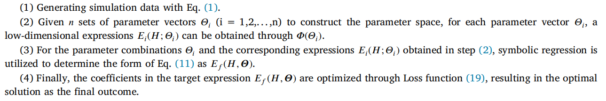

# A novel approach for dimensionality reduction of high-dimensional stochastic dynamical systems using symbolic regression

[doi:https://doi.org/10.1016/j.ymssp.2024.111373](https://doi.org/10.1016/j.ymssp.2024.111373)

## 1.introduction

Here's the code for the paper.The numerical experiments in this thesis are mainly realized by matlab.This is an experimental code, readability is poor, I try to write a note to help you understand this code.

Let's review the four steps of the simulation, which makes it easier to understand the code:

## 2.What's in the code?

All simulated intermediate data, computed results, images from the paper.

## 3.Structure 

| path               | goal                                                         |
| ------------------ | ------------------------------------------------------------ |
| \5-dof             | Simulation experiments with a 5-degree-of-freedom model      |
| \5-dof\data        | Storing the generated simulation data, corresponding to step (1) |
| \5-dof\Global_SR   | code for step(4)                                             |
| \5-dof\Local_SR    | code for step(2)                                             |
| \5-dof\res_fig     | Storing the figures of step (2)                              |
| \ssr               | Storing the results of the calculations from the second step (2) |
| \N-DOF             | Simulation experiments with a 10-degree-of-freedom model and a 20-degree-of-freedom model |
| \res               | Results of step (2)                                          |
| \res-global        | Results of step (4)                                          |
| \Theoretical_Value | Theoretical analysis results for the 5-DOF model             |
| ML_Express.jl      | julia code for step (3)                                      |

## 4.Core code

The 5-dof model is the most critical code on which subsequent codes modify parameters.

| file                                    | goal                                                         |
| --------------------------------------- | ------------------------------------------------------------ |
| \5-dof\gen_data.m                       | Generate simulation data. The code uses a number of programming tricks to improve computational efficiency |
| \5-dof\Local_SR\ssr_cost.m              | Loss function of the optimization process in step (2)        |
| \5-dof\Local_SRSSR_local.m              | Optimization process for step (2)                            |
| \5-dof\Local_SRSSR_HC.m                 | Optimization process for step (2). Running on a supercomputing platform with multi-processing turned on |
| \5-dof\validate_ploy.m                  | Verify the first and second order moments                    |
| \5-dof\validate_H.m                     | Verify the steady-state probability density                  |
| \5-dof\Global_SR\global_cost.m          | Loss function of the optimization process in step (4)        |
| \5-dof\Global_SR\global_optimize.m      | Optimization process for step (4)                            |
| \5-dof\Global_SR\global_validate_H.m    | Verify the steady-state probability density                  |
| \5-dof\Global_SR\global_validate_ploy.m | Verify the first and second order moments                    |

